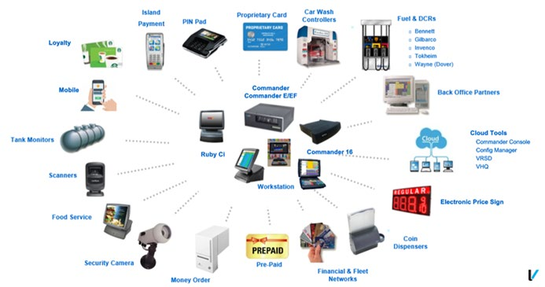

# Commander 
## User Reference

### Petro Ecosystem

  

# Using This User Reference
This User Reference provides detailed information about Verifone's point-ofsale (POS) devices on a function key-by-function key basis.

Each of the topics are divided into the following sections:

* **Overview** - This section contains a brief description about each topic.
* **Using** - This section explains how the particular topic or function is used to process and manage sales transactions.
* **Configuring** - This section contains information on how to configure the relevant parameters using Configuration Client.
* **Reporting** - This section contains sample reports with a detailed report description.
* **Troubleshooting** - This section may contain some trouble scenarios that may occur along with the steps needed to correct them. In some cases the user may need to perform procedures that are restricted to higher security levels (i.e. manager level as opposed to cashier).

:::note
Refer to the **Feature Reference Documents** for additional information on features. The Feature Reference documents are available on [`Premier Portal`].
:::

:::note
Change the default configuration settings in Configuration Client only if you are sure you have to edit the settings.
:::

The Verifone Commander™ is a high-powered server that increases the capacity and functionality of Verifone’s ethernet capable Point of Sale (POS) workstations by extending the processing and communications bandwidth for managing peripherals.

Future needs are designed into the hardware to provide support for additional serial ports and CPU boards along with additional fan and/or power connection that may be needed as a result. Use of these expansion capabilities will be determined by Verifone. System peripherals, such as fuel dispensers, dispenser card readers (DCRs),and car wash controllers connect directly to the Verifone Commander.

In addition to **Configuration Client**, Verifone Commander also has other site management software: Report Navigator, Transaction Manager and Verifone Commander Console. Report Navigator is used to view reporting data for the store. Reporting information such as the close day report can be configured to include a multitude of report options. Transaction Manager allows for site transaction logs and data to be accessed from the Verifone Commander or archived locally. Verifone Commander Console enables multiple store reporting data to be consolidated into one place for easy visibility to monitor and track sales trends.

  

The Verifone Commander contains a built in V950, referred to as the V950SC. When a router is installed in this configuration, it can be configured so that the Verifone Commander’s V950SC can:

* Receive software upgrades remotely using Verifone’s Remote Software Download feature.
* Connect with the Verifone Helpdesk for remote troubleshooting and diagnostics.

